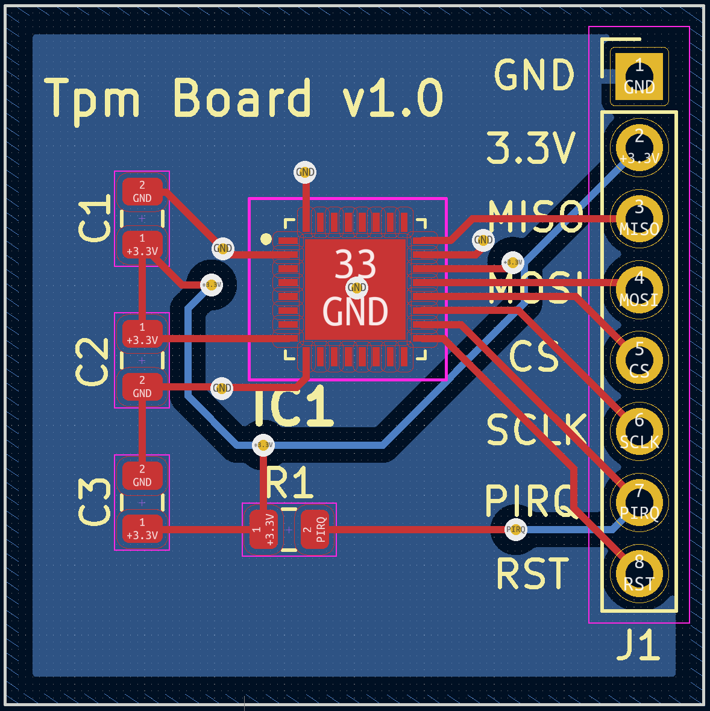
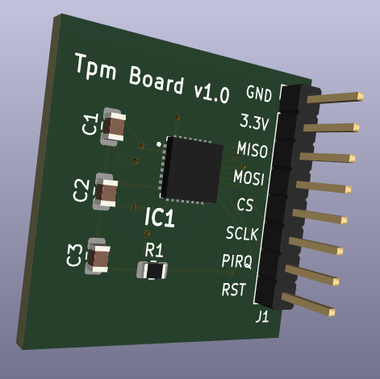

## A PCB for OPTIGA™ SLB 9670 TPM2.0




### Description

This is a KiCad project for a simple breakout PCB around the OPTIGA™ SLB 9670 TPM2.0 chip. The OPTIGA™ SLB 9670 TPM2.0 uses the SPI serial interface to a host. You can connect this board to a PC motherboard (using jumper wires), or to an SBC like the raspberry pi (more details below).

### Why?

Because there is a price hike on TPM2.0 boards due to Windows 11 requirements. Also, this is a great learning tool for TPM2.0 technology, instead of using a software emulated TPM.

### Connecting to the raspberry pi

#### Wiring
Connect the board power pin to the 3.3v on the pi, also connect ground. Connect the SPI MISO, MOSI, and SCLK pins. The Chip Select (CS) pin should be connected to SPI_CE0 pin on the raspberry pi. You can leave the RST and PIRQ pins unconneced.

#### Update the device tree on the raspberry pi to detect the SLB 9670

Create a small tmp.dts file on the pi, with the following contents:

```
/*
* Device Tree overlay for Infineon SLx 9670
*/
/dts-v1/;
/plugin/;
/ {
	compatible = "brcm,bcm2835", "brcm,bcm2708", "brcm,bcm2709";
	fragment@0 {
		target = <&spi0>;
		__overlay__ {
			status = "okay";
		};
	};
	fragment@1 {
		target = <&spidev0>;
		__overlay__ {
			status = "disabled";
		};
	};
	fragment@2 {
		target = <&spi0>;
		__overlay__ {
			/* needed to avoid dtc warning */
			#address-cells = <1>;
			#size-cells = <0>;
			slb9670: slb9670@0{
				compatible = "infineon,slb9670";
				reg = <0>; /* CE1 */
				#address-cells = <1>;
				#size-cells = <0>;
				spi-max-frequency = <32000000>;
				status = "okay";
			};
		};
	};
};
```

compile the `tpm.dts` file into `tpm.dtbo` binary using the `dtc` tool (install using apt install as needed):   
```
$ dtc -@ -I dts -O dtb -o tpm.dtbo tpm.dts
```

Finally, copy the compiled overlay file to the overlay directory:
```
sudo cp tpm.dtbo /boot/overlays/
```

And reboot. You should see the following output in dmesg indicating success:
```
...
[   46.308765] tpm_tis_spi spi0.0: 2.0 TPM (device-id 0x1B, rev-id 22)
...
```
and the following device files are created:
```
$ ls -la /dev/tpm*

crw-rw---- 1 tss root  10,   224 Apr 26 16:44 /dev/tpm0
crw-rw---- 1 tss tss  239, 65536 Apr 26 16:44 /dev/tpmrm0
```